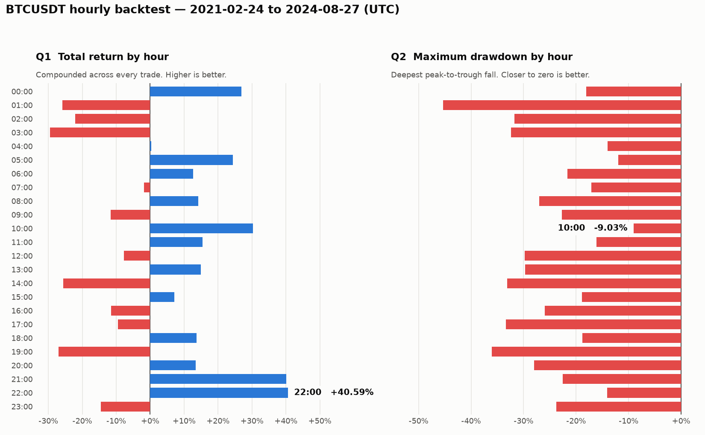

# BTC Hourly Backtest

[](https://github.com/dylan-fletcher/alpaca-takehome-assignment/actions/workflows/ci.yml)

A dbt + Postgres pipeline over Binance's 1-second BTCUSDT data, answering two
questions about hourly trading strategies: which hour of the day returned the
most, and which had the lowest maximum losses.

One command, against a throwaway Postgres container. Reproducible from a clean
checkout plus the source CSV.

---

## Quickstart

```bash
./run.sh                                       # first load: 13.6 GB, ~10 min
./query.sh "select count(*) from raw.btc_1s"   # scratch queries
```

Put `half2_BTCUSDT_1s.csv` in the repo root first. It is not committed, and
neither is any other `.csv`.

Requirements: Docker (with WSL integration on Windows) and
[uv](https://docs.astral.sh/uv/). `uv run` syncs the Python environment from
`uv.lock` on every run.

The load happens once and survives restarts, so `./run.sh` normally goes
straight to `dbt build`. `--reload` forces a fresh `COPY`. `--skip-load`
iterates on models without touching the data.

---

## Results

Over 1,281 trading days, 2021-02-24 to 2024-08-27 (UTC):

| | Answer | |
|---|---|---|
| **Q1** — biggest returns | **22:00 UTC** | +40.59% compounded |
| **Q2** — lowest maximum loss | **10:00 UTC** | max drawdown −9.03% |

<picture>
  <source media="(prefers-color-scheme: dark)" srcset="docs/ranking-dark.png">
  
</picture>

**Q2 has two answers, depending on what "maximum losses" means.** Profits are
reinvested, so capital compounds across days. Measured as the drawdown of that
equity curve, the answer is **10:00**. Measured as the worst single day, it is
**22:00**. Drawdown leads, because the brief reinvests profits. Worst single day
only fits a fixed daily stake.

Both panels use the same hour axis, so the two can be compared. 22:00's losing
days cluster together: its worst day is the shallowest of any hour (−2.92%), but
its drawdown is only the fourth shallowest (−14.10%). 10:00's losses are spread
out, so it has a worse single day (−3.57%) but a much shallower drawdown.

The full ranking prints on every `./run.sh`. The top and bottom of it:

| Hour (UTC) | Trades | Total return | Max drawdown | Worst day | Win rate |
|---|---|---|---|---|---|
| 22:00 | 1281 | **+40.59%** | −14.10% | **−2.92%** | 51.3% |
| 21:00 | 1281 | +40.13% | −22.55% | −5.15% | 54.5% |
| 10:00 | 1281 | +30.28% | **−9.03%** | −3.57% | 51.3% |
| … | | | | | |
| 01:00 | 1281 | −25.81% | −45.29% | −5.41% | 48.2% |
| 19:00 | 1281 | −26.95% | −36.05% | −6.24% | 51.7% |
| 03:00 | 1278 | −29.49% | −32.37% | −6.44% | 51.6% |

`Trades` ranges from 1277 to 1281 out of 1,281 possible days. The seven outages
below cost some hours a few days each. The count is shown rather than hidden, so
uneven comparisons stay visible.

**These describe one sample, not a forecast.** Best to worst is 70 percentage
points, but that is the best of 24 candidates over 3.5 years, and every hour's
win rate is close to a coin flip.

### Repeating the analysis

The brief asks for this to be repeatable "for different hours and days of
entering the market". Each slice is a flag:

```bash
./run.sh --skip-load --trade-hour 22                   # one hour of the day
./run.sh --skip-load --day-of-week 1                   # Mondays only
./run.sh --skip-load --start-date 2023-01-01 --end-date 2023-12-31
./run.sh --skip-load --trade-hour 22 --day-of-week 1   # they compose
```

Each flag maps to a dbt var of the same name, so the same slices work with
`dbt build --vars`. Unset flags use the `dbt_project.yml` defaults.

---

## Assumptions

Where the brief left room, this is how it was read.

| Assumption | Reasoning |
|---|---|
| **Buy at the open of `:00:00`, sell at the close of `:59:59`** | The literal reading of "first second of the hour" and "last second of that hour". |
| **Returns compound** | The brief reinvests profits, so per-trade multipliers multiply. Summing percentages would assume the same stake every day. |
| **"Maximum losses" means drawdown, with worst single day also reported** | Reinvestment makes the account an equity curve. Both are printed, because the brief allows both readings. |
| **2021-02-23 is excluded** | The file starts at 09:20:20, so hours 10–23 could trade that day and hours 00–09 could not. Leaving it in gives later hours a free extra trade. |
| **Hours missing a boundary price are dropped, not filled** | There was no trade to make. A nearby price would invent one the analyst could not have made. |
| **Returns are gross** | No fees or slippage. See [Limitations](#limitations). |
| **All timestamps are UTC** | Binance publishes UTC. Nothing is converted. |

Compounding punishes volatility; averaging does not. Over the untrimmed span the
two differ by up to 3 percentage points (hour 15 is +10.85% compounded against
+14.06% summed) and several mid-table hours swap places. They agree on the
winner. `avg_return_pct` stays on the fact table so the comparison is available.

---

## Modeling decisions

Data flows CSV → `raw` → `staging` → `intermediate` → `facts`.

**`raw` mirrors the CSV; cleaning happens in `staging`.** `raw.btc_1s` is a
byte-for-byte copy, so defects stay visible.
`stg_binance__btcusdt_1s_ohlcv` deduplicates, renames (`open` and `close` are
reserved words; volume is split into base and quote) and drops the unused
`ignore` column. No joins, no aggregation.

**The uniqueness defect is tested twice.** `warn` on the source keeps the raw
problem visible. `error` on the staging model proves the deduplication works.

**The hourly model keeps only the two seconds the strategy trades.** 3,600 rows
per hour become the `:00:00` open and the `:59:59` close. High, low and volume
would be columns nothing reads.

**Those two seconds are picked with a `where` clause, not a ranking.** Taking
the first available row instead (`first_value`, or a windowed `row_number`)
would give 2021-04-25 08:00 an entry price from 08:45:00, after the exchange had
been down all hour.

**Two fact models, not one.** `fct_btcusdt_hourly_trades` is the per-trade
ledger. `fct_btcusdt_strategy_by_hour` aggregates it to the 24 rows the
questions ask about. The ledger keeps `trade_date` and `day_of_week`, so "what
about Mondays?" is a `group by` rather than a new model.

**Compounding lives in a macro.** Postgres has no `product()` aggregate, so
`macros/product.sql` uses `a * b * c = exp(ln a + ln b + ln c)`. Keeping that in
one place beats repeating `exp(sum(ln(x)))` at every call site.
`running_product()` is the same identity as a window function, and gives the
equity curve the drawdown is measured against.
`tests/assert_product_macro_is_exact` checks both against `2 * 3 * 4 = 24`.

**The drawdown high-water mark starts at the opening stake**
(`greatest(peak, 1)`). Without it, an hour that loses money before hitting a new
high measures its fall from the dip instead of from the start. Hour 04 reads
−13.59% that way, against a true −14.02%.

**Both "lowest maximum loss" columns are negative**, so the answer is the
largest value: `order by ... desc`. Sorting ascending returns the wrong hour and
looks right doing it, so `sql/final_query.sql` says so in a comment.

**Timestamps stay naive `timestamp`, not `timestamptz`.** Casting would make
`extract(hour from ...)` depend on the session `TimeZone`, and that is the
grouping key for the whole backtest.

**`sql/load.sql` also runs under `psql`.** `db.statements()` strips psql
backslash commands and expands `:'var'` itself, so the same file works through
`run.py` and through `psql -f /sql/load.sql` in the container.

---

## Data source

[Binance Bitcoin Dataset 1 Second — Part 2](https://www.kaggle.com/datasets/tzelal/binance-bitcoin-dataset-1s-timeframe-p2)
(Kaggle, user `tzelal`, CC0), collected from <https://data.binance.vision/> and
merged by the uploader. Part 1 (2017 onward) is not loaded.

| | |
|---|---|
| Rows loaded | 110,671,732 (110,671,480 after deduplication) |
| Coverage | 2021-02-23 09:20:20 → 2024-08-27 23:59:59 (UTC) |
| Grain | one row per second |
| Columns | 12, matching Binance's `/klines` payload |

Each row is one second of trading: **o**pen, **h**igh, **l**ow and **c**lose
price plus **v**olume, which is where `stg_binance__btcusdt_1s_ohlcv` gets its
name. The rest are timestamps, a trade count, and volume split by whether the
buyer was the taker.

The row count adds up: 110,671,733 lines is one header plus 110,671,732 rows.
The Kaggle page claims `110671734` and its slicing snippet assumes no header,
but the distributed file has one, so `COPY ... HEADER true` is correct.

---

## Data quality findings

All figures come from the full 110.7M rows, never the fixture. The anomalies are
too rare for a sample to catch.

**The three defects below all come from the same seven events.** Each event is
an outage in the data collection. The pattern repeats every time: recording
stops (in four of the seven, the last second before the stop is cut short),
nothing is recorded during the outage, and when recording resumes the uploader's
merge repeats the first eight seconds. So there are two things to do: drop the
repeated rows, and report the gaps.

### 1. Duplicate timestamps — 56 timestamps, 252 spurious rows

The source is **not** unique on `open_time`. 308 rows share 56 timestamps and
collapse to 56 distinct rows. Every duplicate is byte-identical across all 12
columns, which is what makes deduplication safe.

The repeats come in seven blocks of eight consecutive seconds, one per affected
day, and the number of copies steps down through each block (`03:30:00` ×9,
`03:30:01` ×8 … `03:30:07` ×2). Affected days: 2021-03-06, 04-20, 04-25, 08-13,
09-29, 12-24 and 2023-03-24. Each contributes 8 timestamps and 44 rows.

**This matters.** Left in, the duplicates inflate hourly traded volume by up to
**+20.5%** (2021-08-13 06:00), then +12.6%, +10.2%, +7.8%, +4.7%, +2.2% and
+1.5% in the other six.

### 2. Missing seconds — 59,700 across 7 outage windows

The span covers 110,731,180 seconds. 110,671,480 rows remain after dedup, so
**59,700 seconds are missing** (0.054%).

| Gap starts after | Resumes at | Missing |
|---|---|---|
| 2021-03-06 01:59:59 | 2021-03-06 03:30:00 | 1h 30m |
| 2021-04-20 01:59:59 | 2021-04-20 04:30:00 | 2h 30m |
| 2021-04-25 04:00:58 | 2021-04-25 08:45:00 | 4h 44m |
| 2021-08-13 01:59:59 | 2021-08-13 06:30:00 | 4h 30m |
| 2021-09-29 06:59:59 | 2021-09-29 09:00:00 | 2h 00m |
| 2021-12-24 04:59:54 | 2021-12-24 05:00:36 | 41s |
| 2023-03-24 12:39:41 | 2023-03-24 14:00:00 | 1h 20m |

Kaggle's explorer reports "Missing 0%", but that counts null values in rows that
exist, not missing timestamps. Only the second matters here.

### 3. Rows that end early — 4 of them

`close_time` is normally `open_time + 999ms`. Four rows close early instead
(146ms, 0ms, 362ms and 646ms short), each at a collection boundary on a day that
also has repeated seconds. Each row is still in the right second, so hourly
bucketing is unaffected. Noted, not corrected.

### 4. Hourly completeness — 22 of 30,759 hours cannot be traded

The strategy trades at two specific seconds, so the only completeness question
is whether `:00:00` and `:59:59` exist.

| | |
|---|---|
| Hour buckets in span | 30,759 |
| Entirely absent (wholly inside an outage) | 13 |
| Present but missing a boundary second | 9 |
| **Untradeable** | **22** (0.07%) |

All 22 fall inside the seven outages, mostly between 02:00 and 08:00 UTC.

Counting this on `raw` gives the wrong answer: the repeats pad a bucket out to
3,600 rows when it holds fewer than 3,600 distinct seconds. The rollup reads the
deduplicated staging model instead.

### 5. Clean results

- `ignore` is `0` in all 110,671,732 rows, with no nulls.
- No row has `high < low`, and none has taker-buy volume above total volume.
- The two volume columns are labelled the right way round. Dividing
  `quote_volume` by `base_volume` gives an average price in USDT per bitcoin,
  and on every row with volume that average falls between the row's own `low`
  and `high`. If the labels were swapped, it would not.

---

## Testing

Severity is used consistently, so a failing build always means the same thing.

- **Source tests run at `warn`.** They describe the file as it arrived, so known
  defects show up on every build without failing it.
- **Staging and fact tests run at `error`.** Staging asserts what must hold:
  primary key, not-null on the traded columns. Nothing in `models/facts/` comes
  from the source, so a failure there means the backtest computed a wrong
  number.
- **Tests report the useful number.** Gap detection uses
  `dbt_utils.sequential_values`, which flags the row after each break and
  reports **7 outages** instead of 59,700 missing seconds.
- **Related assertions are combined.** Each test scans 110M rows (30–75s), so
  the checks that open, high, low and close make sense together are one
  `expression_is_true` instead of four that fail for the same reason.

Three assertions span more than one model and live in `tests/` as singular
tests:

| Test | Catches |
|---|---|
| `assert_product_macro_is_exact` | either compounding macro drifting from `2 * 3 * 4 = 24` |
| `assert_all_24_hours_are_ranked` | an hour vanishing from the ranking, which would still return a plausible winner |
| `assert_summary_accounts_for_every_trade` | the two fact models' filters diverging |

The second is disabled when `trade_hour` is set, because 23 missing hours are
then expected.

`pytest` covers the Python side: `db.statements()` and the `run.py` validators.
CI runs SQL lint, `pytest` and `dbt parse` on every push. It cannot run
`dbt build`, which needs the 13.6 GB dataset.

---

## How it runs

`run.sh` is a thin shim. `run.py` does the work: it starts Postgres
(`docker compose up --wait`, blocking on the healthcheck), runs `sql/load.sql`,
runs `dbt build`, then runs `sql/final_query.sql` and redraws the charts.

**The `COPY` is server-side.** The CSV is bind-mounted into the container and
Postgres reads it directly, instead of streaming 13.6 GB through the client. The
load takes **623 seconds**.

The landing table is logged and sits on a named Docker volume, so it survives
`docker compose down`. `UNLOGGED` would copy about twice as fast, but Postgres
truncates those after an unclean shutdown, and the cost that repeats here is
rebuilding models, not loading.

```
run.sh / run.py          entrypoint and orchestration
query.sh / query.py      scratch queries against the database
db.py                    shared connection + psql-script helpers
sql/load.sql             landing-table DDL and COPY
sql/final_query.sql      the two answers
models/staging/binance/  source definition, staging model, tests
models/intermediate/     hourly rollup to the grain the backtest trades on
models/facts/            the trade ledger and the per-hour ranking
macros/product.sql       multiply a column across a group, and along a curve
tests/                   singular dbt tests, plus tests/python/ for pytest
scripts/                 SQL linting and chart rendering
docker-compose.yml       Postgres 16
```

To exercise the load path without waiting ten minutes:

```bash
head -n 200001 half2_BTCUSDT_1s.csv > fixture.csv   # header + 200k rows
./run.sh --csv ./fixture.csv --reload
```

---

## Limitations

- **Only Part 2 is loaded**, so results start at 2021-02-24. Part 1 covers
  2017-08-17 to 2021-02-23.
- **No trading costs.** Binance spot fees are about 0.1% per side, so 0.2% per
  round trip. The winning hour averages 0.03% per trade, so fees would wipe out
  the edge. The ranking describes price behaviour, not a profitable strategy.
- **No significance testing.** `trade_count` and `stddev_return_pct` are on the
  fact table, but nothing computes a confidence interval or corrects for
  comparing 24 hours at once. That is the first thing to add before acting on
  the ranking.
- **Fills are assumed at the printed price**, with no slippage and no size
  limit.
